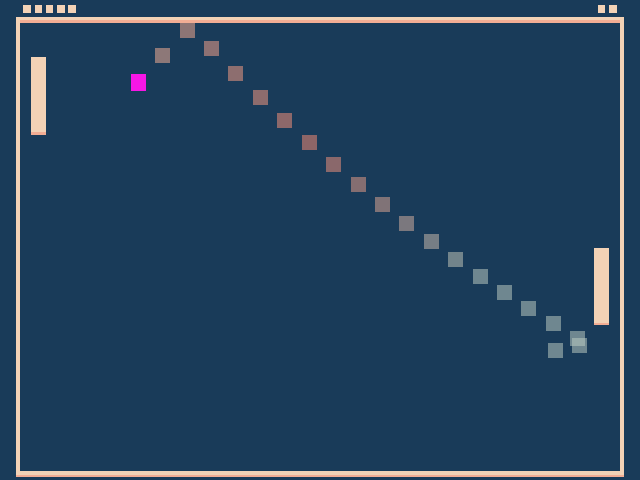

# Power-up Pong

Author: Tejas Srivatsav

Design: This version of pong includes wacky power-ups that affect the ball's movement, the paddles, and the controls. These power-ups come into effect at random times and will keep you on your toes.

Screen Shot:

How To Play:

While the goal and controls are the same as regular pong, understanding what each power-up does is key to mastery of this game. The color of the ball signifies the power-up in effect.

Red - Both paddles are bigger and therefore it is easier to hit the ball. Aiming for the corners is the only way you can score here.
Light Blue - Both paddles are smaller and therefore it is harder to hit the ball. Mouse skill is key.
Yellow - Your paddle becomes invisible. Align your cursor and try to hit the center of your paddle. Aiming for corners is especially risky here.
Green - The ball moves much faster. Can you keep up?
Purple - The ball's direction after hitting a paddle or wall is the opposite of what it normally would be. Hint: Make the ball bounce between two corners.
Orange - The ball is tiny. Time to buy a bigger monitor. Or you can just follow the ball's trail. 
Brown - Your controls are reversed. Move your cursor up to move down and move down to move up.
Pink - The ball will spin as it moves. Either it will curve towards the center or towards the walls.
White - Regular pong. Take this chance to regroup.

Sources:

This game was built with [NEST](NEST.md). No other sources were used.
